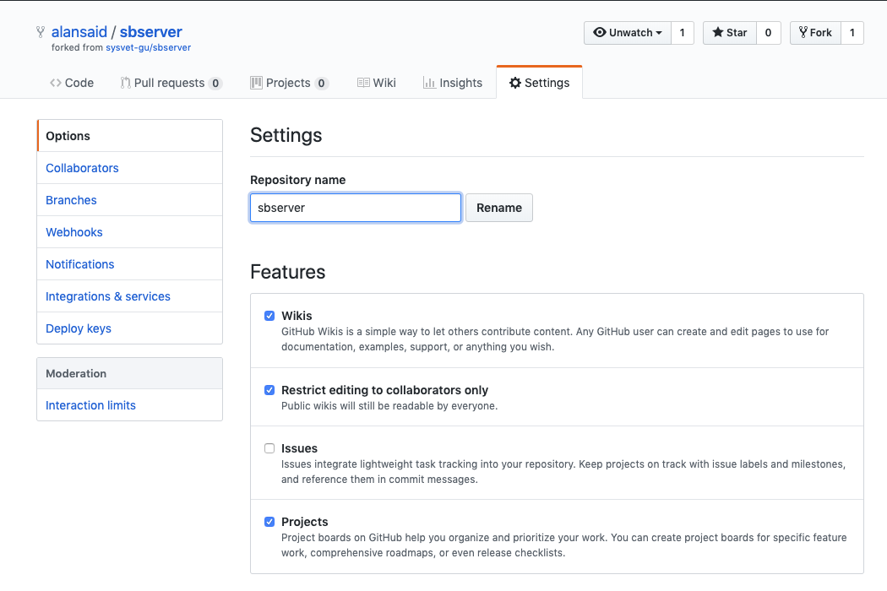
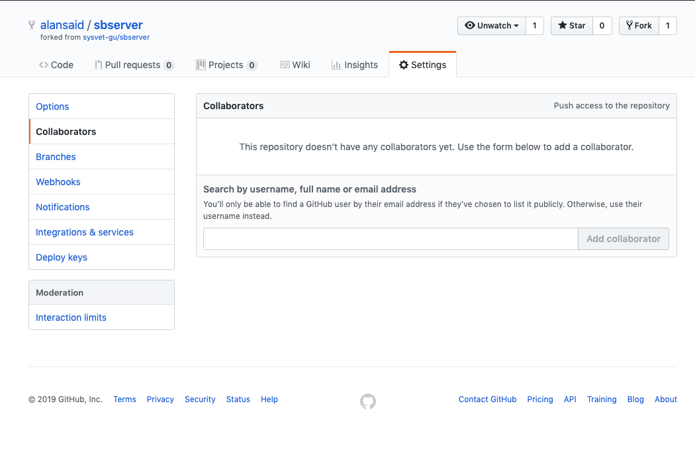

# Systembolagsserver

Systembolagsservern innehåller en maveniserad version av systembolagsservern ni arbetat med i TIG058.

Maven strukturerar källkoden på ett specifikt sätt, det är viktigt att hålla sig till strukturen för att programmet ska fungera.

Strukturen är som följer, detaljerad förklaring nedan
```
├── pom.xml
├── readme.md
└── src
    ├── main
    │   ├── java
    │   │   └── se
    │   │       └── gu
    │   │           └── ait
    │   │               └── sbserver
    │   │                   ├── domain
    │   │                   │   └── Product.java
    │   │                   ├── main
    │   │                   │   ├── TestJsonExporter.java
    │   │                   │   ├── TestProductLine.java
    │   │                   │   ├── TestSQLInsertExporter.java
    │   │                   │   ├── TestStreams.java
    │   │                   │   └── TestSwing.java
    │   │                   ├── servlet
    │   │                   │   ├── Constraint.java
    │   │                   │   ├── Formatter.java
    │   │                   │   ├── FormatterFactory.java
    │   │                   │   ├── JsonFormatter.java
    │   │                   │   ├── ParameterParser.java
    │   │                   │   ├── SystemetAPIv1.java
    │   │                   │   └── SystemetWebAPI.java
    │   │                   └── storage
    │   │                       ├── AbstractProductExporter.java
    │   │                       ├── CSVHelper.java
    │   │                       ├── DBHelper.java
    │   │                       ├── FakeProductLine.java
    │   │                       ├── JsonExporter.java
    │   │                       ├── ProductGroupExporter.java
    │   │                       ├── ProductGroups.java
    │   │                       ├── ProductLine.java
    │   │                       ├── ProductLineFactory.java
    │   │                       ├── SQLBasedProductLine.java
    │   │                       ├── SQLInsertExporter.java
    │   │                       ├── XMLBasedProductLine.java
    │   │                       └── package-info.java
    │   ├── resources
    │   │   ├── bolaget.db
    │   │   ├── log4j2.xml
    │   │   └── products.csv
    │   └── webapp
    │       └── WEB-INF
    │           ├── api.html
    │           ├── search.html
    │           ├── style.css
    │           └── web.xml
    └── test
        └── java
```

1. `````pom.xml````` pomfilen är Mavens konfigurationsfil för projektet. Filen innehåller information som Maven behöver för att kompilera projektet. Om man behöver använda externa bibliotek behöver dessa skrivas in i pomfilen. Med allra största sannolikhet kommer ni inte att behöva ändra något i filen, information om hur filen är uppbyggd finns [här](https://maven.apache.org/guides/introduction/introduction-to-dependency-mechanism.html) 
1. `````readme.md````` filen som innehåller texten som ni läser nu. Detta är ingen mavenfil utan en fil som beskrivet innehållet i ett github-repository.
1. `````src/````` mappen src är mappen under vilken all källkod, test, och övriga resurser ligger.
1. `````src/main````` här ligger all källkod och övriga resurser, ej test.
1. `````src/main/java````` här ligger all javakod.
1. `````src/main/resources/````` här ligger alla övriga resurser, exempelvis produktdatabas.
1. `````src/main/webapp````` här ligger filerna som syns i webappen 
1. `````src/test````` här lägger man implementationer av test

## Kompileringsinstruktioner

För att kompilera systembolagsservern behöver ni har Maven installerat på era datorer. Instruktioner för att installera Maven finns nedan.

Mavenkompilering är strukturerad kring olika type of build cycles, allt från att validera att projektet innehåller alla klasser som förväntas (validate), till att leverera/installera projektet på en server eller liknande (deploy). I den här uppgiften arbetar vi med cyklerna ````clean````, ````compile````, samt en variant av deploy, nämligen ````tomcat7:run```` som startar en lokal webbserver och kör vår servlet.

* För att kompilera projektet, från projektroten, skriv: ````mvn compile```` detta kommer att kompilera programmet. Resultatet kommer att sparas i den nyskapade mappen ```target```. Kommandot borde resultera i en output liknande detta: 
```
sbserver >  mvn compile
[INFO] Scanning for projects...
[INFO]
[INFO] --------------------< se.gu.ait.sbserver:sbserver >---------------------
[INFO] Building sbserver 1.0-SNAPSHOT
[INFO] --------------------------------[ war ]---------------------------------
[INFO]
[INFO] --- maven-resources-plugin:2.6:resources (default-resources) @ sbserver ---
[INFO] Using 'UTF-8' encoding to copy filtered resources.
[INFO] Copying 3 resources
[INFO]
[INFO] --- maven-compiler-plugin:3.1:compile (default-compile) @ sbserver ---
[INFO] Changes detected - recompiling the module!
[INFO] Compiling 26 source files to /Users/alan/work/sbserver/target/classes
[INFO] ------------------------------------------------------------------------
[INFO] BUILD SUCCESS
[INFO] ------------------------------------------------------------------------
[INFO] Total time:  1.230 s
[INFO] Finished at: 2019-04-16T14:09:50+02:00
[INFO] ------------------------------------------------------------------------
```
* För att köra webappen i en lokal webbserver, exekvera följande från projektets rot: ````mvn tomcat7:run````. Resultatet borde vara liknande detta:
```
sbserver >  mvn tomcat7:run 
[INFO] Scanning for projects...
[INFO]
[INFO] --------------------< se.gu.ait.sbserver:sbserver >---------------------
[INFO] Building sbserver 1.0-SNAPSHOT
[INFO] --------------------------------[ war ]---------------------------------
[INFO]
[INFO] >>> tomcat7-maven-plugin:2.2:run (default-cli) > process-classes @ sbserver >>>
[INFO]
[INFO] --- maven-resources-plugin:2.6:resources (default-resources) @ sbserver ---
[INFO] Using 'UTF-8' encoding to copy filtered resources.
[INFO] Copying 3 resources
[INFO]
[INFO] --- maven-compiler-plugin:3.1:compile (default-compile) @ sbserver ---
[INFO] Changes detected - recompiling the module!
[INFO] Compiling 26 source files to /Users/alan/work/sbserver/target/classes
[INFO]
[INFO] <<< tomcat7-maven-plugin:2.2:run (default-cli) < process-classes @ sbserver <<<
[INFO]
[INFO]
[INFO] --- tomcat7-maven-plugin:2.2:run (default-cli) @ sbserver ---
[INFO] Running war on http://localhost:9090/sbserver
[INFO] Creating Tomcat server configuration at /Users/alan/work/sbserver/target/tomcat
[INFO] create webapp with contextPath: /sbserver
apr 16, 2019 2:15:59 EM org.apache.coyote.AbstractProtocol init
INFO: Initializing ProtocolHandler ["http-bio-9090"]
apr 16, 2019 2:15:59 EM org.apache.catalina.core.StandardService startInternal
INFO: Starting service Tomcat
apr 16, 2019 2:15:59 EM org.apache.catalina.core.StandardEngine startInternal
INFO: Starting Servlet Engine: Apache Tomcat/7.0.47
apr 16, 2019 2:16:01 EM org.apache.coyote.AbstractProtocol start
INFO: Starting ProtocolHandler ["http-bio-9090"]
```  
När ni kommit så här långt så kan ni öppna denna länken [http://localhost:9090/sbserver/search/products/all?](http://localhost:9090/sbserver/search/products/all?) där eran lokala webbserver körs. För att stänga ner webbservern går ni tillbaka till fönstret där ni kört era mavenkommandon och trycker control+c.

## Installera Maven

###  Maven i macOS
För att installera Maven i macOS kör ni kommandot
```brew install maven```

### Maven i Windows / CygWin
Börja med att sätta miljövarabeln ```JAVA_HOME``` till den mapp som ni har Java installerat i, något i stil med ```c:\Program Files\Java\jdk1.8.0_191```, men detta är beroende på Windows och Javaversion. I CygWin kan ni skriva ```cygpath -u "$(which javac | sed -e 's,bin/javac,,')"``` för att få indikation på vad variabeln ska vara satt till. Kopiera inte rätt av, utan se till så ni får rätt format på strängen.

När ni satt ```JAVA_HOME```så kan ni följa instruktionerna på denna sida för att installera Maven i Windows:
[https://geekforum.wordpress.com/2015/03/19/install-git-and-maven-for-cygwin/](https://geekforum.wordpress.com/2015/03/19/install-git-and-maven-for-cygwin/)

 

### Maven i Linux
Använd den pakethanterare som din linuxdist använder, exempelvis ````apt-get````

# Arbeta med servern
Gör en fork av repositoryt (knappen längst upp till höger på denna sida). Efter detta kommer ni att ha en egen version av koden. Det är i denna som ni ska arbeta i gruppen. Det räcker att en person gör en fork av repot och ger de andra medlemmarna skrivrättigheter till repot.
Ni behöver aktivera issues för er fork av repot. Det gör ni i er inställningarna till er fork på Github, bilden nedan visar ett exempel. Bocka för boxen bredvid issues.
När ni öppnar den här sidan i eran fork, kommer [den här länken](../../settings) att leda er till sidan med inställningar för er fork.


För att ge era gruppmedlemmar skrivrättigheter till er fork behöve ni lägga till dem som collaborators i inställningarna till er fork. Bilden nedan visar ett exempel, skriv in era gruppmedlemmars mailadress eller githubidentiter i textfältet under Collaborators för att göra detta. 
När ni öppnar den här sidan i eran fork, kommer [den här länken](../../settings/collaborators) att leda er till sidan med collaborators-inställningar för er fork.

